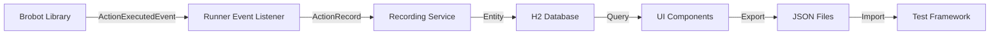

# Action Recording and Persistence

## Overview

The Brobot Runner application provides comprehensive ActionRecord persistence capabilities, allowing you to capture, store, and replay automation execution history. This feature enables:

- Recording live automation sessions
- Building test data from real executions
- Analyzing automation patterns and performance
- Exporting ActionHistory for mock testing
- Debugging and troubleshooting automation issues

## Architecture

### Separation of Concerns

The Brobot architecture maintains clear separation between execution and persistence:

- **Library (brobot)**: Focuses on automation execution, pattern matching, and action performance
- **Runner (brobot/runner)**: Handles persistence, UI, recording, and session management

This design ensures the library remains lightweight while the Runner provides rich data management features.

### Data Flow



## Using Action Recording

### Enabling Recording in the UI

1. **Start Recording**:
   - Click the Record button in the Runner toolbar
   - Enter a session name (e.g., "Login Flow Test")
   - Recording indicator turns red

2. **During Recording**:
   - All executed actions are automatically captured
   - Real-time statistics display in the status bar
   - Success rate updates dynamically

3. **Stop Recording**:
   - Click the Record button again
   - Session is saved to the database
   - Statistics summary is displayed

### Recording Sessions

Each recording session captures:

- **Action Details**: Type, configuration, timing, success/failure
- **Match Data**: Found regions, similarity scores, screenshots
- **State Context**: Current state, transitions, state IDs
- **Performance Metrics**: Duration, resource usage, timing patterns
- **Application Context**: Application under test, environment

### Session Management

The Runner provides comprehensive session management:

```java
// Sessions are managed through the UI, but can be accessed programmatically
public interface RecordingSessionRepository {
    List<RecordingSessionEntity> findAll();
    List<RecordingSessionEntity> findByApplication(String app);
    List<RecordingSessionEntity> findByDateRange(LocalDateTime from, LocalDateTime to);
    RecordingSessionEntity findByName(String name);
}
```

## Exporting ActionHistory

### Export Formats

The Runner supports multiple export formats:

#### JSON Export (Default)
```json
{
  "timesSearched": 150,
  "timesFound": 142,
  "snapshots": [
    {
      "actionConfig": {
        "@type": "PatternFindOptions",
        "strategy": "BEST",
        "similarity": 0.85
      },
      "actionSuccess": true,
      "duration": 245,
      "matchList": [
        {
          "x": 100,
          "y": 200,
          "w": 50,
          "h": 30,
          "simScore": 0.92
        }
      ],
      "timestamp": "2024-01-15T10:30:45"
    }
  ]
}
```

#### CSV Export
For data analysis and spreadsheet tools:
```csv
timestamp,action_type,success,duration_ms,similarity,x,y,width,height
2024-01-15T10:30:45,FIND,true,245,0.92,100,200,50,30
2024-01-15T10:30:46,CLICK,true,150,0.88,100,200,50,30
```

### Export Process

1. **From UI**:
   - Select session in the History panel
   - Click Export button
   - Choose format and location
   - File is saved with session metadata

2. **Bulk Export**:
   - Select multiple sessions
   - Export as batch
   - Creates zip archive with all sessions

3. **Automated Export**:
   ```yaml
   # Configure auto-export in application.yml
   brobot:
     runner:
       recording:
         auto-export: true
         export-path: /data/exports
         export-format: JSON
   ```

## Importing ActionHistory

### For Testing

Import recorded sessions into your test framework:

```java
@SpringBootTest
public class RecordedDataTest {
    
    @Test
    public void testWithRecordedData() throws IOException {
        // Load exported ActionHistory
        ObjectMapper mapper = new ObjectMapper();
        ActionHistory history = mapper.readValue(
            new File("exports/login-flow-2024-01-15.json"),
            ActionHistory.class
        );
        
        // Apply to StateImage for mock testing
        StateImage loginButton = new StateImage.Builder()
            .withPattern("login-button.png")
            .build();
        loginButton.setActionHistory(history);
        
        // Run tests with real recorded data
        Optional<ActionRecord> snapshot = history.getRandomSnapshot(
            new PatternFindOptions.Builder().build()
        );
        
        assertTrue(snapshot.isPresent());
        assertTrue(snapshot.get().isActionSuccess());
    }
}
```

### For Analysis

Load sessions for pattern analysis:

```java
public class SessionAnalyzer {
    
    public void analyzeSession(File exportFile) throws IOException {
        ActionHistory history = loadHistory(exportFile);
        
        // Calculate success rate
        double successRate = history.getTimesFound() * 100.0 / 
                           history.getTimesSearched();
        
        // Analyze timing patterns
        DoubleSummaryStatistics timingStats = history.getSnapshots().stream()
            .filter(ActionRecord::isActionSuccess)
            .mapToDouble(ActionRecord::getDuration)
            .summaryStatistics();
        
        System.out.println("Success Rate: " + successRate + "%");
        System.out.println("Avg Duration: " + timingStats.getAverage() + "ms");
        System.out.println("Max Duration: " + timingStats.getMax() + "ms");
    }
}
```

## Database Schema

The Runner uses an H2 database with the following schema:

### Recording Sessions Table
```sql
CREATE TABLE recording_sessions (
    id BIGINT PRIMARY KEY AUTO_INCREMENT,
    session_name VARCHAR(255),
    start_time TIMESTAMP,
    end_time TIMESTAMP,
    total_actions INT,
    successful_actions INT,
    application VARCHAR(255),
    description TEXT,
    exported BOOLEAN DEFAULT FALSE,
    export_path VARCHAR(500)
);
```

### Action Records Table
```sql
CREATE TABLE action_records (
    id BIGINT PRIMARY KEY AUTO_INCREMENT,
    session_id BIGINT,
    action_config_type VARCHAR(100),
    action_config_json TEXT,
    action_success BOOLEAN,
    duration_ms BIGINT,
    text_result TEXT,
    timestamp TIMESTAMP,
    state_id BIGINT,
    state_name VARCHAR(255),
    object_name VARCHAR(255),
    FOREIGN KEY (session_id) REFERENCES recording_sessions(id)
);
```

### Matches Table
```sql
CREATE TABLE matches (
    id BIGINT PRIMARY KEY AUTO_INCREMENT,
    action_record_id BIGINT,
    x INT,
    y INT,
    width INT,
    height INT,
    similarity_score DOUBLE,
    screenshot_path VARCHAR(500),
    FOREIGN KEY (action_record_id) REFERENCES action_records(id)
);
```

## Configuration

### Runner Configuration

Configure recording behavior in `application.yml`:

```yaml
brobot:
  runner:
    recording:
      # Recording settings
      enabled: false                    # Default recording state
      auto-save: true                   # Auto-save during recording
      save-interval: 60                 # Seconds between auto-saves
      
      # Storage limits
      max-records-per-session: 10000    # Maximum records per session
      max-sessions: 100                 # Maximum stored sessions
      
      # Export settings
      export-format: JSON               # Default export format
      compress-exports: true            # Compress large exports
      
      # Database maintenance
      retention-days: 30                # Keep sessions for 30 days
      cleanup-enabled: true             # Auto-cleanup old sessions
      cleanup-schedule: "0 0 2 * * ?"   # Run at 2 AM daily
      
      # Performance
      batch-size: 100                   # Batch insert size
      async-recording: true             # Non-blocking recording
```

### Performance Tuning

For high-volume recording:

```yaml
brobot:
  runner:
    recording:
      # Optimize for performance
      async-recording: true
      batch-size: 500
      save-interval: 300  # 5 minutes
      
      # Reduce storage
      store-screenshots: false
      compress-matches: true
      
      # Memory management
      max-memory-buffer: 1000  # Records in memory
      flush-on-memory-pressure: true
```

## UI Components

### Recording Control Panel

The Recording Control Panel provides:

- **Record Button**: Start/stop recording
- **Session Selector**: Choose active session
- **Statistics Display**: Live action counts and success rate
- **Export Controls**: Quick export of current session

### Action History Viewer

View and analyze recorded actions:

- **Table View**: Sortable, filterable action list
- **Timeline View**: Visual representation of actions over time
- **Detail View**: Deep dive into specific actions
- **Comparison View**: Compare multiple sessions

### Filtering and Search

Advanced filtering options:

- **By Success**: Show only successful/failed actions
- **By Type**: Filter by action type (FIND, CLICK, TYPE, etc.)
- **By State**: Show actions from specific states
- **By Time**: Date/time range filtering
- **By Pattern**: Text search in action details

## Best Practices

### Recording Strategy

1. **Focused Sessions**: Record specific workflows separately
2. **Clean Environments**: Ensure consistent test conditions
3. **Multiple Runs**: Record the same workflow multiple times
4. **Failure Scenarios**: Intentionally record failures for testing
5. **Performance Baselines**: Record during different load conditions

### Data Management

1. **Regular Exports**: Export important sessions before cleanup
2. **Version Control**: Store exports with your test code
3. **Descriptive Names**: Use clear, searchable session names
4. **Metadata**: Add descriptions to sessions for context
5. **Cleanup Policy**: Configure retention based on your needs

### Testing with Recorded Data

1. **Deterministic Tests**: Use seeded random for reproducibility
2. **Data Validation**: Verify imported data integrity
3. **Performance Benchmarks**: Compare against recorded baselines
4. **Edge Cases**: Include failure scenarios in test data
5. **Regular Updates**: Refresh test data periodically

## Troubleshooting

### Common Issues

**Recording Not Starting**:
- Check Runner is connected to automation
- Verify database is accessible
- Ensure sufficient disk space

**Missing Actions**:
- Verify event listeners are registered
- Check action execution is generating events
- Review log files for errors

**Export Failures**:
- Validate export path permissions
- Check disk space
- Verify session exists in database

**Performance Issues**:
- Increase batch size
- Enable async recording
- Reduce screenshot storage
- Configure cleanup schedule

### Debug Logging

Enable detailed logging:

```yaml
logging:
  level:
    io.github.jspinak.brobot.runner.recording: DEBUG
    io.github.jspinak.brobot.runner.persistence: DEBUG
```

## API Reference

### Recording Service API

```java
public interface ActionRecordingService {
    // Session management
    void startRecording(String sessionName, String application);
    void stopRecording();
    boolean isRecording();
    
    // Action recording
    void recordAction(ActionRecord record, StateImage stateImage);
    void recordBatch(List<ActionRecord> records);
    
    // Export/Import
    ActionHistory exportSession(Long sessionId);
    void importSession(ActionHistory history, String sessionName);
    
    // Query
    List<RecordingSessionEntity> getAllSessions();
    RecordingSessionEntity getSession(Long sessionId);
    List<ActionRecordEntity> getSessionRecords(Long sessionId);
}
```

### Event API

```java
// Events published by the recording system
public class RecordingStartedEvent {
    private RecordingSessionEntity session;
}

public class RecordingStoppedEvent {
    private RecordingSessionEntity session;
    private int totalRecorded;
}

public class ActionRecordedEvent {
    private ActionRecordEntity record;
    private RecordingSessionEntity session;
}
```

## Migration from Library Persistence

If you were previously using persistence in the library:

1. **Export existing data** from your database
2. **Import into Runner** using the import feature
3. **Update test configuration** to load from Runner exports
4. **Remove library persistence** configuration

The Runner provides superior persistence capabilities with UI management, making it the recommended approach for ActionHistory persistence.