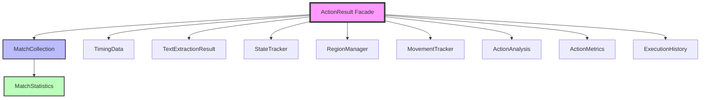

# ActionResult Components Quick Reference

## Component Overview

ActionResult v2.0 delegates to specialized components for different responsibilities. This quick reference helps you find the right component for your needs.

## Component Directory

### Core Match Operations → `MatchCollection`
```java
MatchCollection matches = result.getMatchCollection();
```
- Add/remove matches
- Sort by score, size, distance
- Filter by criteria
- Get best match
- Get statistics
- Set operations (union, intersection, minus)

**Common Operations:**
```java
matches.add(match1, match2);
matches.sortByScoreDescending();
matches.filterByMinScore(0.8);
Optional<Match> best = matches.getBest();
```

### Statistical Analysis → `MatchStatistics`
```java
MatchStatistics stats = result.getMatchCollection().getStatistics();
```
- Average/min/max scores
- Median region/location
- Standard deviation
- Confidence levels
- Bounding boxes
- Density calculations

**Common Operations:**
```java
double avgScore = stats.getAverageScore();
Optional<Region> median = stats.getMedianRegion();
ConfidenceLevel confidence = stats.getConfidence();
```

### Timing & Duration → `TimingData`
```java
TimingData timing = result.getTimingData();
```
- Start/stop timing
- Calculate duration
- Track time segments
- Format time output

**Common Operations:**
```java
timing.start();
timing.stop();
Duration elapsed = timing.getElapsed();
timing.addSegment("search", searchDuration);
```

### Text Extraction → `TextExtractionResult`
```java
TextExtractionResult text = result.getTextResult();
```
- Accumulated text
- Selected text
- Match-specific text
- Text merging

**Common Operations:**
```java
text.addText("extracted text");
text.setSelectedText("highlighted");
String combined = text.getCombinedText();
```

### State Tracking → `StateTracker`
```java
StateTracker states = result.getStateTracker();
```
- Active states
- State-match mapping
- Activation counts
- Most active state

**Common Operations:**
```java
states.recordActiveState("LoginScreen");
boolean isActive = states.isStateActive("LoginScreen");
Optional<String> mostActive = states.getMostActiveState();
```

### Region Management → `RegionManager`
```java
RegionManager regions = result.getRegionManager();
```
- Define regions
- Named regions
- Union/intersection
- Area-based operations

**Common Operations:**
```java
regions.defineRegion(new Region(x, y, w, h));
regions.defineNamedRegion("button", buttonRegion);
Optional<Region> union = regions.getUnion();
```

### Movement Tracking → `MovementTracker`
```java
MovementTracker movements = result.getMovementTracker();
```
- Record movements
- Calculate distances
- Path analysis
- Bounding boxes

**Common Operations:**
```java
movements.recordMovement(start, end);
double totalDistance = movements.getTotalDistance();
boolean isClosed = movements.isClosedPath(5.0);
```

### Analysis Data → `ActionAnalysis`
```java
ActionAnalysis analysis = result.getActionAnalysis();
```
- Scene analyses
- Binary masks
- Custom analysis storage
- Type-safe retrieval

**Common Operations:**
```java
analysis.addSceneAnalysis(sceneAnalysis);
analysis.setMask(binaryMask);
analysis.addCustomAnalysis("profile", colorProfile);
```

### Performance Metrics → `ActionMetrics`
```java
ActionMetrics metrics = result.getActionMetrics();
```
- Execution time
- Retry tracking
- Phase timings
- Efficiency scores

**Common Operations:**
```java
metrics.recordExecutionTime(duration);
metrics.recordRetry(retryDuration);
metrics.recordPhase("validation", validationTime);
double efficiency = metrics.getEfficiencyScore();
```

### Execution History → `ExecutionHistory`
```java
ExecutionHistory history = result.getExecutionHistory();
```
- Action records
- Success/failure tracking
- Timeline generation
- Success rates

**Common Operations:**
```java
history.recordStep(actionRecord);
double successRate = history.getSuccessRate();
String timeline = history.formatTimeline();
```

## Quick Lookup Table

| I want to... | Use Component | Method |
|-------------|---------------|--------|
| Add a match | MatchCollection | `add(match)` |
| Sort matches | MatchCollection | `sortByScoreDescending()` |
| Filter matches | MatchCollection | `filterByMinScore(0.8)` |
| Get best match | MatchCollection | `getBest()` |
| Get match statistics | MatchStatistics | `getAverageScore()` |
| Track timing | TimingData | `start()`, `stop()` |
| Store extracted text | TextExtractionResult | `addText(string)` |
| Track active states | StateTracker | `recordActiveState(name)` |
| Define regions | RegionManager | `defineRegion(region)` |
| Record movements | MovementTracker | `recordMovement(movement)` |
| Add scene analysis | ActionAnalysis | `addSceneAnalysis(analysis)` |
| Track performance | ActionMetrics | `recordExecutionTime(ms)` |
| Record history | ExecutionHistory | `recordStep(record)` |

## Component Creation

Components are automatically created when accessed through ActionResult:

```java
ActionResult result = new ActionResult();

// Components created on demand
result.add(match);              // Creates MatchCollection
result.addString("text");        // Creates TextExtractionResult  
result.addDefinedRegion(region); // Creates RegionManager
// etc.
```

## Direct Component Access

For advanced operations, access components directly:

```java
// Basic facade usage
result.sortMatchObjects();
List<Match> matches = result.getMatchList();

// Advanced component usage
MatchCollection collection = result.getMatchCollection();
collection.sort(SortStrategy.DISTANCE_FROM_LOCATION);
MatchStatistics stats = collection.getStatistics();
double density = stats.getDensity();
```

## Builder Pattern

Use ActionResultBuilder for clean construction:

```java
ActionResult result = new ActionResultBuilder()
    .withSuccess(true)
    .withMatches(matchList)
    .withTiming(startTime, endTime)
    .withActiveState("MainMenu")
    .withText("Button clicked")
    .build();
```

## Component Interactions



## Performance Tips

1. **Access components once**: Store reference if using multiple times
2. **Use appropriate methods**: Component methods are optimized
3. **Leverage statistics**: Don't recalculate what's already computed
4. **Clear when done**: Call `clear()` on components to free memory
5. **Use builders**: More efficient than multiple setter calls

## Common Patterns

### Pattern: Analyze Match Quality
```java
MatchStatistics stats = result.getMatchCollection().getStatistics();
if (stats.getConfidence() == ConfidenceLevel.HIGH) {
    // High confidence in matches
    processMatches(result.getMatchList());
}
```

### Pattern: Track Multi-Phase Timing
```java
TimingData timing = result.getTimingData();
timing.addSegment("search", searchTime);
timing.addSegment("verify", verifyTime);
timing.addSegment("action", actionTime);
logger.info("Performance: {}", timing.format());
```

### Pattern: State-Aware Processing
```java
StateTracker tracker = result.getStateTracker();
if (tracker.isStateActive("ErrorDialog")) {
    handleError(tracker.getMatchesForState("ErrorDialog"));
}
```

## See Also

- [ActionResult Architecture](../architecture/actionresult-architecture.md) - Complete architectural documentation
- [ActionResult Migration Guide](../migration/actionresult-refactoring.md) - Migration from v1.x to v2.0
- [ActionConfig Overview](./01-overview.md) - Action configuration documentation