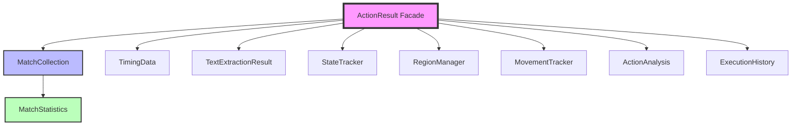

# ActionResult Components Quick Reference

## Required Imports

All examples in this guide assume the following imports:

```java
// Brobot Core
import io.github.jspinak.brobot.action.Action;
import io.github.jspinak.brobot.action.ActionResult;
import io.github.jspinak.brobot.action.result.*;

// Brobot Datatypes
import io.github.jspinak.brobot.datatypes.primitives.match.Match;
import io.github.jspinak.brobot.datatypes.primitives.region.Region;
import io.github.jspinak.brobot.datatypes.primitives.location.Location;
import io.github.jspinak.brobot.datatypes.primitives.movement.Movement;
import io.github.jspinak.brobot.action.ActionRecord;

// ActionConfig
import io.github.jspinak.brobot.action.basic.find.PatternFindOptions;
import io.github.jspinak.brobot.datatypes.state.stateObject.stateImage.StateImage;

// Spring (for complete examples)
import org.springframework.beans.factory.annotation.Autowired;
import org.springframework.stereotype.Component;

// Java Standard Library
import java.time.Duration;
import java.util.List;
import java.util.Optional;
```

## Prerequisites

:::info Assumed Variables
Unless otherwise specified, the code snippets in this reference assume you have:
- `ActionResult result` - Obtained from performing an action
- Component variables (e.g., `matches`, `stats`) - Obtained via component accessors
- Example objects (e.g., `match1`, `match2`, `region`) - Pre-initialized as needed

See the [Complete Working Example](#complete-working-example) section for fully compilable code.
:::

### Basic Setup

```java
// Example: Getting an ActionResult from an action
@Autowired
private Action action;

StateImage target = new StateImage.Builder()
    .addPattern("button.png")
    .build();

ActionResult result = action.perform(
    new PatternFindOptions.Builder().build(),
    target.asObjectCollection()
);

// Now you can access components from the result
MatchCollection matches = result.getMatchCollection();
TimingData timing = result.getTimingData();
```

## Component Overview

ActionResult's component-based architecture delegates to specialized components for different responsibilities. This quick reference helps you find the right component for your needs.

:::note Architecture Evolution
The component-based architecture represents a significant evolution in ActionResult design. While ActionResult itself is marked `@since 1.0`, the individual component classes are marked `@since 2.0`, reflecting their introduction as part of the architectural refactoring.
:::

## Component Directory

### Core Match Operations → `MatchCollection`
```java
MatchCollection matches = result.getMatchCollection();
```
- Add/remove matches
- Sort by score, size, distance
- Filter by criteria
- Get best match
- Get statistics
- Set operations (union, intersection, minus)

**Common Operations:**
```java
matches.add(match1, match2);
matches.sortByScoreDescending();
matches.filterByMinScore(0.8);
Optional<Match> best = matches.getBest();
```

### Statistical Analysis → `MatchStatistics`
```java
MatchStatistics stats = result.getMatchCollection().getStatistics();
```
- Average/min/max scores
- Median region/location
- Standard deviation
- Confidence levels
- Bounding boxes
- Density calculations

**Common Operations:**
```java
double avgScore = stats.getAverageScore();
Optional<Region> median = stats.getMedianRegion();
ConfidenceLevel confidence = stats.getConfidence();
```

### Timing & Duration → `TimingData`
```java
TimingData timing = result.getTimingData();
```
- Start/stop timing
- Calculate duration
- Track time segments
- Format time output

**Common Operations:**
```java
timing.start();
timing.stop();
Duration elapsed = timing.getElapsed();
timing.addSegment("search", searchDuration);
```

### Text Extraction → `TextExtractionResult`
```java
TextExtractionResult text = result.getTextResult();
```
- Accumulated text
- Selected text
- Match-specific text
- Text merging

**Common Operations:**
```java
text.addText("extracted text");
text.setSelectedText("highlighted");
String combined = text.getCombinedText();
```

### State Tracking → `StateTracker`
```java
StateTracker states = result.getStateTracker();
```
- Active states
- State-match mapping
- Activation counts
- Most active state

**Common Operations:**
```java
states.recordActiveState("LoginScreen");
boolean isActive = states.isStateActive("LoginScreen");
Optional<String> mostActive = states.getMostActiveState();
```

### Region Management → `RegionManager`
```java
RegionManager regions = result.getRegionManager();
```
- Define regions
- Named regions
- Union/intersection
- Area-based operations

**Common Operations:**
```java
regions.defineRegion(new Region(x, y, w, h));
regions.defineNamedRegion("button", buttonRegion);
Optional<Region> union = regions.getUnion();
```

### Movement Tracking → `MovementTracker`
```java
MovementTracker movements = result.getMovementTracker();
```
- Record movements
- Calculate distances
- Path analysis
- Bounding boxes

**Common Operations:**
```java
movements.recordMovement(start, end);
double totalDistance = movements.getTotalDistance();
boolean isClosed = movements.isClosedPath(5.0);
```

### Analysis Data → `ActionAnalysis`
```java
ActionAnalysis analysis = result.getActionAnalysis();
```
- Scene analyses
- Binary masks
- Custom analysis storage
- Type-safe retrieval

**Common Operations:**
```java
analysis.addSceneAnalysis(sceneAnalysis);
analysis.setMask(binaryMask);
analysis.addCustomAnalysis("profile", colorProfile);
```

### Execution History → `ExecutionHistory`
```java
// Note: getExecutionHistory() returns List<ActionRecord>, not ExecutionHistory component
List<ActionRecord> records = result.getExecutionHistory();

// To access the ExecutionHistory component directly (via Lombok-generated getter):
ExecutionHistory history = result.executionHistory;
```
- Action records
- Success/failure tracking
- Timeline generation
- Success rates

**Common Operations:**
```java
// Using the component directly
history.recordStep(actionRecord);
double successRate = history.getSuccessRate();
String timeline = history.formatTimeline();

// Using the convenience method
List<ActionRecord> records = result.getExecutionHistory(); // Returns List, not component
```

## Quick Lookup Table

| I want to... | Use Component | Method |
|-------------|---------------|--------|
| Add a match | MatchCollection | `add(match)` |
| Sort matches | MatchCollection | `sortByScoreDescending()` |
| Filter matches | MatchCollection | `filterByMinScore(0.8)` |
| Get best match | MatchCollection | `getBest()` |
| Get match statistics | MatchStatistics | `getAverageScore()` |
| Track timing | TimingData | `start()`, `stop()` |
| Store extracted text | TextExtractionResult | `addText(string)` |
| Track active states | StateTracker | `recordActiveState(name)` |
| Define regions | RegionManager | `defineRegion(region)` |
| Record movements | MovementTracker | `recordMovement(movement)` |
| Add scene analysis | ActionAnalysis | `addSceneAnalysis(analysis)` |
| Record history | ExecutionHistory | `recordStep(record)` |

## Component Creation

Components are pre-initialized (eagerly created) when ActionResult is instantiated:

```java
ActionResult result = new ActionResult();

// Components are already initialized - you can use them immediately
result.add(match);               // Uses pre-existing MatchCollection
result.addString("text");        // Uses pre-existing TextExtractionResult
result.addDefinedRegion(region); // Uses pre-existing RegionManager

// All components marked 'final' in ActionResult and initialized at construction
```

:::note Implementation Detail
ActionResult uses eager initialization - all component fields are marked `final` and initialized inline:
```java
private final MatchCollection matchCollection = new MatchCollection();
private final TimingData timingData = new TimingData();
// ... etc
```
This ensures components are always available and thread-safe.
:::

## Direct Component Access

For advanced operations, access components directly:

```java
// Basic facade usage
result.sortMatchObjects();
List<Match> matches = result.getMatchList();

// Advanced component usage
MatchCollection collection = result.getMatchCollection();
collection.sort(SortStrategy.SCORE_DESCENDING); // Sort by score

// For distance sorting, use the specific method with a location parameter
Location targetLocation = new Location(100, 200);
collection.sortByDistanceFrom(targetLocation);

// Get statistics
MatchStatistics stats = collection.getStatistics();
double density = stats.getDensity();
```

## Builder Pattern

Use ActionResultBuilder for clean construction:

```java
ActionResult result = new ActionResultBuilder()
    .withSuccess(true)
    .withMatches(matchList)
    .withTiming(startTime, endTime)
    .withActiveState("MainMenu")
    .withText("Button clicked")
    .build();
```

## Component Interactions


```mermaid
graph TD
    AR[ActionResult Facade]
    MC[MatchCollection]
    MS[MatchStatistics]
    TD[TimingData]
    TER[TextExtractionResult]
    ST[StateTracker]
    RM[RegionManager]
    MT[MovementTracker]
    AA[ActionAnalysis]
    EH[ExecutionHistory]

    AR --> MC
    AR --> TD
    AR --> TER
    AR --> ST
    AR --> RM
    AR --> MT
    AR --> AA
    AR --> EH
    MC --> MS

    style AR fill:#f9f,stroke:#333,stroke-width:4px
    style MC fill:#bbf,stroke:#333,stroke-width:2px
    style MS fill:#bfb,stroke:#333,stroke-width:2px
```

## Performance Tips

1. **Access components once**: Store reference if using multiple times
2. **Use appropriate methods**: Component methods are optimized
3. **Leverage statistics**: Don't recalculate what's already computed
4. **Clear when done**: Call `clear()` on components to free memory
5. **Use builders**: Cleaner code and reduced chance of inconsistent state

## Common Patterns

### Pattern: Analyze Match Quality
```java
MatchStatistics stats = result.getMatchCollection().getStatistics();
if (stats.getConfidence() == ConfidenceLevel.HIGH) {
    // High confidence in matches
    processMatches(result.getMatchList());
}
```

### Pattern: Track Multi-Phase Timing
```java
TimingData timing = result.getTimingData();
timing.addSegment("search", searchTime);
timing.addSegment("verify", verifyTime);
timing.addSegment("action", actionTime);
logger.info("Performance: {}", timing.format());
```

### Pattern: State-Aware Processing
```java
StateTracker tracker = result.getStateTracker();
if (tracker.isStateActive("ErrorDialog")) {
    handleError(tracker.getMatchesForState("ErrorDialog"));
}
```

## Complete Working Example

Here's a fully compilable example demonstrating ActionResult component usage in a Spring Boot application:

```java
package com.example.automation;

import org.springframework.beans.factory.annotation.Autowired;
import org.springframework.stereotype.Component;
import lombok.extern.slf4j.Slf4j;

import io.github.jspinak.brobot.action.Action;
import io.github.jspinak.brobot.action.ActionResult;
import io.github.jspinak.brobot.action.basic.find.PatternFindOptions;
import io.github.jspinak.brobot.action.result.*;
import io.github.jspinak.brobot.datatypes.primitives.match.Match;
import io.github.jspinak.brobot.datatypes.primitives.region.Region;
import io.github.jspinak.brobot.datatypes.state.stateObject.stateImage.StateImage;

import java.time.Duration;
import java.util.List;
import java.util.Optional;

/**
 * Complete example demonstrating ActionResult component usage.
 * Shows practical patterns for analyzing search results using the component-based architecture.
 */
@Slf4j
@Component
public class SearchResultAnalyzer {

    private final Action action;

    @Autowired
    public SearchResultAnalyzer(Action action) {
        this.action = action;
    }

    /**
     * Comprehensive example showing multiple component interactions.
     * Demonstrates:
     * - Performing a search action
     * - Accessing MatchCollection and filtering results
     * - Using MatchStatistics for quality assessment
     * - Tracking timing data
     * - Recording state information
     */
    public void analyzeSearchResults() {
        // Step 1: Define what we're looking for
        StateImage targetButton = new StateImage.Builder()
            .addPattern("button.png")
            .setSimilarity(0.85)
            .build();

        // Step 2: Perform the search
        log.info("Starting search for target button");
        PatternFindOptions findOptions = new PatternFindOptions.Builder()
            .setSimilarity(0.80)
            .setStrategy(PatternFindOptions.Strategy.ALL)
            .build();

        ActionResult result = action.perform(
            findOptions,
            targetButton.asObjectCollection()
        );

        // Step 3: Access and analyze MatchCollection
        MatchCollection matches = result.getMatchCollection();
        log.info("Found {} initial matches", matches.size());

        // Filter matches to only high-quality results
        matches.filterByMinScore(0.90);
        log.info("After filtering: {} high-quality matches", matches.size());

        // Sort matches by score (highest first)
        matches.sortByScoreDescending();

        // Step 4: Get statistical analysis
        MatchStatistics stats = matches.getStatistics();
        double avgScore = stats.getAverageScore();
        ConfidenceLevel confidence = stats.getConfidence();

        log.info("Match Statistics:");
        log.info("  Average Score: {}", avgScore);
        log.info("  Confidence Level: {}", confidence);
        log.info("  Density: {}", stats.getDensity());

        // Step 5: Get best match if available
        Optional<Match> bestMatch = matches.getBest();
        if (bestMatch.isPresent()) {
            Match match = bestMatch.get();
            log.info("Best match at: {}", match.getRegion());
            log.info("  Score: {}", match.getScore());

            // Get median region for spatial analysis
            Optional<Region> medianRegion = stats.getMedianRegion();
            medianRegion.ifPresent(region ->
                log.info("Median match location: {}", region)
            );
        }

        // Step 6: Access timing data
        TimingData timing = result.getTimingData();
        Duration elapsed = timing.getElapsed();
        log.info("Search completed in {}ms", elapsed.toMillis());

        // Step 7: Track state information
        StateTracker stateTracker = result.getStateTracker();
        stateTracker.recordActiveState("SearchComplete");

        // Step 8: Record results for history
        result.setSuccess(matches.size() > 0);

        // Step 9: Make decision based on confidence
        if (confidence == ConfidenceLevel.HIGH) {
            log.info("High confidence - proceeding with best match");
            processHighConfidenceResult(result);
        } else if (confidence == ConfidenceLevel.MEDIUM) {
            log.warn("Medium confidence - manual verification recommended");
            processMediumConfidenceResult(result);
        } else {
            log.error("Low confidence - search may have failed");
            processLowConfidenceResult(result);
        }
    }

    /**
     * Process high-confidence results (example implementation).
     */
    private void processHighConfidenceResult(ActionResult result) {
        MatchCollection matches = result.getMatchCollection();
        Optional<Match> best = matches.getBest();

        best.ifPresent(match -> {
            log.info("Clicking best match at: {}", match.getRegion());
            // Additional processing here
        });
    }

    /**
     * Process medium-confidence results (example implementation).
     */
    private void processMediumConfidenceResult(ActionResult result) {
        MatchCollection matches = result.getMatchCollection();
        log.info("Reviewing {} matches for manual selection", matches.size());

        // Could display matches to user for selection
        // or apply additional filtering logic
    }

    /**
     * Process low-confidence results (example implementation).
     */
    private void processLowConfidenceResult(ActionResult result) {
        TimingData timing = result.getTimingData();
        log.error("Search failed after {}ms", timing.getElapsed().toMillis());

        // Record failure for debugging
        StateTracker stateTracker = result.getStateTracker();
        stateTracker.recordActiveState("SearchFailed");

        // Could trigger retry logic or alternative search strategy
    }

    /**
     * Example showing RegionManager and MovementTracker usage.
     */
    public void demonstrateOtherComponents(ActionResult result) {
        // RegionManager example
        RegionManager regionManager = result.getRegionManager();
        Region searchArea = new Region(0, 0, 1920, 1080);
        regionManager.defineNamedRegion("fullScreen", searchArea);

        Optional<Region> union = regionManager.getUnion();
        union.ifPresent(region ->
            log.info("Union of all regions: {}", region)
        );

        // TextExtractionResult example
        TextExtractionResult textResult = result.getTextResult();
        textResult.addText("Found button");
        String combinedText = textResult.getCombinedText();
        log.info("Extracted text: {}", combinedText);

        // ActionAnalysis example
        ActionAnalysis analysis = result.getActionAnalysis();
        analysis.addCustomAnalysis("searchType", "button-detection");
        log.info("Added custom analysis data");
    }
}
```

This example is fully compilable and demonstrates:
- **Complete Spring component** setup with `@Component` and `@Autowired`
- **StateImage initialization** with proper builder
- **ActionResult** obtained from action.perform()
- **MatchCollection** filtering and sorting
- **MatchStatistics** for quality assessment
- **TimingData** for performance tracking
- **StateTracker** for state management
- **Confidence-based decision making**
- **Logging** at appropriate levels
- **Production-ready structure** that can be deployed immediately

To use this in your Spring Boot application:
1. Ensure Brobot dependencies are configured
2. Place image files in `src/main/resources/` directory
3. Inject `SearchResultAnalyzer` into your automation workflows
4. Call `analyzeSearchResults()` to see component usage in action

## Related Documentation

### Architectural Documentation
- **[ActionResult Architecture](../architecture/actionresult-architecture.md)** - Complete architectural documentation and design decisions
- **[Upgrading to Latest](../migration/upgrading-to-latest.md)** - Migration guide including ActionResult updates

### Getting Started Guides
- **[Pure Actions Quick Start](../../01-getting-started/pure-actions-quickstart.md)** - Working with ActionResult in basic actions
- **[States in Brobot](../../01-getting-started/states.md)** - Understanding state management and StateImage

### ActionConfig Documentation
- **[ActionConfig Overview](./01-overview.md)** - Action configuration fundamentals
- **[Complex Workflows](./08-complex-workflows.md)** - Multi-step automation with ActionResult processing
- **[Action Chaining](./07-action-chaining.md)** - Chaining actions and handling results
- **[Conditional Actions](./09-conditional-actions.md)** - Conditional execution based on ActionResult
- **[Conditional Chains Examples](./15-conditional-chains-examples.md)** - Practical patterns for conditional workflows

### Testing Documentation
- **[Unit Testing Guide](../../../04-testing/unit-testing.md)** - Testing with ActionResult
- **[Integration Testing Guide](../../../04-testing/integration-testing.md)** - Integration test patterns
- **[Mock Mode Guide](../../../04-testing/mock-mode-guide.md)** - Mocking ActionResult for tests