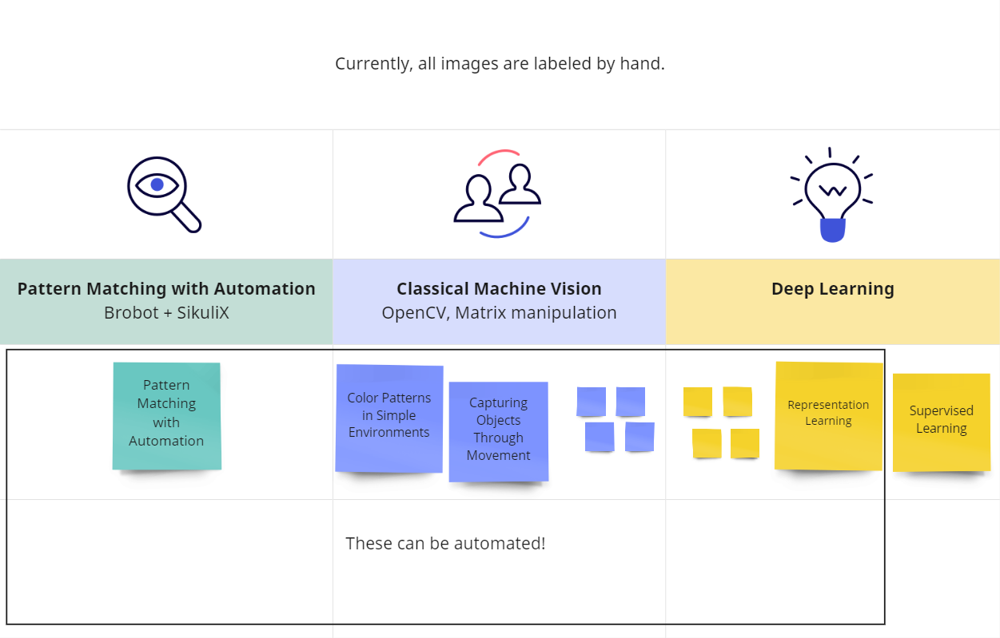

# Labeling Images

Machine Vision research relies on supervised learning to train models, and supervised learning requires the 
use of huge datasets of labeled images. 

These datasets are built by real people who put bounding boxes around cats (and other objects) on millions of images.  

The big guys can afford this, but it's too expensive and time-consuming for the rest of us. 
Luckily, they've made many of these datasets available, but what if we want to classify something other than cats?  

Human-curated datasets are also a bottleneck for research efficiency. Even methods such as _active learning_, 
in which a neural network learns batch by batch and helps the human labeler until the NN has a high enough accuracy, 
require a fair amount of human input. Other areas of ML such as Natural Language
Processing don't have this bottleneck, and MV has FOMO w.r.t. NLP!

In addition, pre-trained deep learning models that have not been trained on the target data can be used 
creatively to label images.  

Brobot's automation framework provides a good basis for building a labeling tool   
_(a ✓ means Brobot now has this functionality, and a_ _____ _means that it's a work in progress)._  
   
✓ Brobot's state-based automation  
✓ [Pattern matching](../tutorial-basics/live-automation.mdx)  
✓ [Color matching](classify.md)   
✓ [Movement](../introduction/finding-objects/movement.md)  
  ...  
_____  Representation learning  
_____  Deep Learning models pre-trained on other data, used creatively  

Note: Labeled datasets built by Brobot would be used for automation, as part of a [Visual API](../../visualAPI)*. 
The goal of Brobot is to be able to control an environment with visual cues. Images for labeling should be collected from the GUI
as screenshots, keeping in mind how easy they will be to classify. For example, when attempting to label 
white cats in a game, if possible they should appear on a non-white background. Often, this can be controlled by 
the user. In contrast, for most deep learning applications in the real world,
the contents of the images cannot be controlled as easily. Brobot is focused only on the 2D environment of the GUI.  

* A Visual API is a representation of the environment that can be used to control it. Similar to a
  programmatic API, a Visual API can be accessed with code and manipulated with the GUI automation tools
  provided by Brobot. To give an example, Starcraft made a programmatic API available to AI researchers
  to test reinforcement learning techniques. What if Starcraft hadn't made an API available yet you
  wanted to use the game to test your AI? Brobot attempts to solve this problem by converting visual cues
  into a programmatic API. 