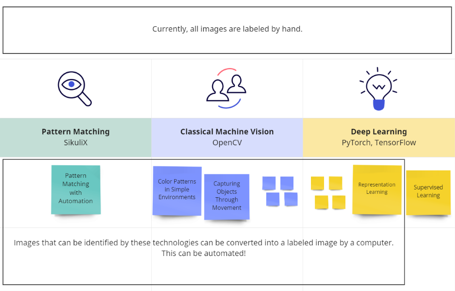

# Labeling Images

Machine Vision research relies on supervised learning to train models, and supervised learning requires the 
use of huge datasets of labeled images. 

These datasets are built by having real people put bounding boxes around cats (and other objects) on millions of images.

The big guys 

 can do afford this, but it's too expensive and time consuming for the rest of us. 
Luckily, they've made many of these datasets available, but what if we want to classify something other than cats?

Human-curated datasets are also a bottleneck for research efficiency. Other areas of ML such as Natural Language
Processing don't have this bottleneck, and MV has FOMO w.r.t. NLP!

Brobot's automation framework provides a good basis for building a labeling tool.   
A ✓ means it's complete, and a _ means that it's a work in progress.  
   
✓ Brobot's state-based automation  
✓ [Pattern matching](../tutorial-basics/live-automation.mdx)  
✓ Color matching   
_____  Movement  
  ...  
_____  Representation learning  