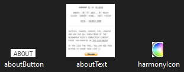
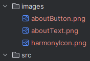

# State Images

There's one more step before starting coding. Let's cut out the images we need. These images 
will define our states and be used to move from state to state. Sometimes, an image will be used
for both identifying a state and for movement between states. We want 3 PNG images: the harmony icon,
the about link, and the about text. Create a folder "images" in the root directory and save these
images there with the names harmonyIcon.png, aboutButton.png, and aboutText.png.  

