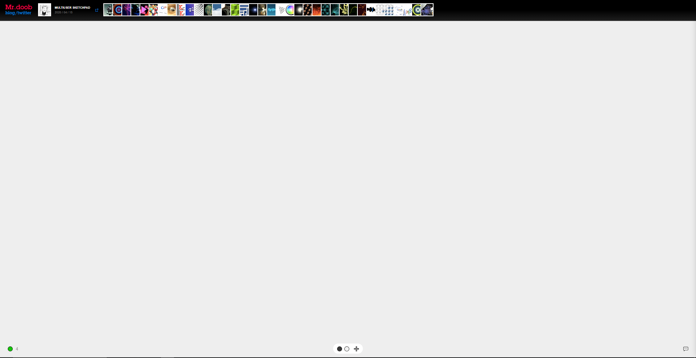
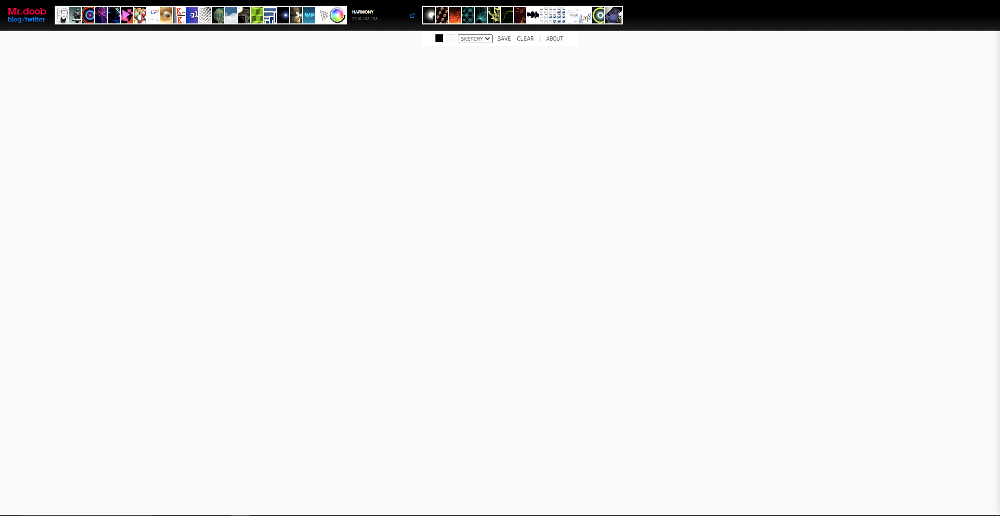
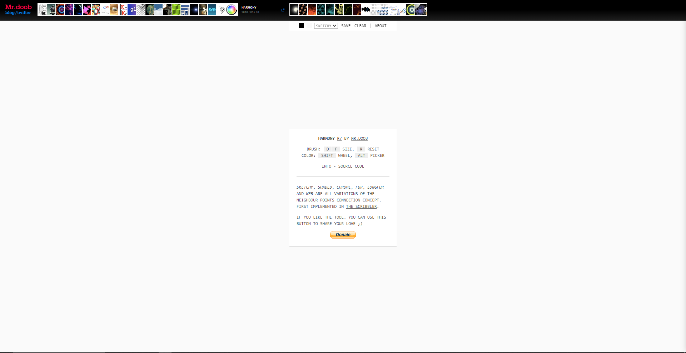
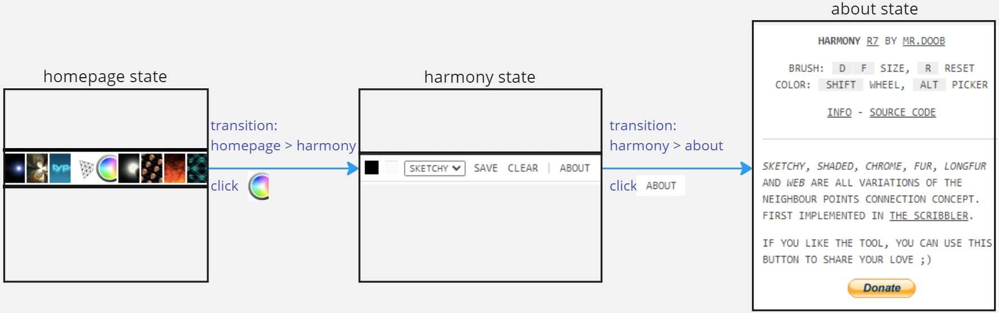
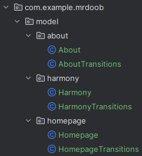

# The Model

Review your target GUI environment and decide what to include in your model.
At this stage, you will focus less on what the automation will do and more on the characteristics
of your target GUI environment. For example, what can you do in this environment and 
what does the GUI look like?  

We will use the Mr.doob website for this tutorial.
Since we want to keep it simple, only 3 screens are important to us: the homepage, a menu bar for 
the "harmony" function (which give users certain drawing tools and allows them to collaborate on a 
sketch), and the "about" text for harmony. 

The Homepage Screen
  

The Harmony Screen
  

The About Screen  

The next step is to develop the model. Each screen corresponds to a GUI state. Think of states as
snapshots of the GUI at a particular point in time. We want to model states in code. Since there are
3 states in our model, we will have 3 directories in our application: homepage, harmony, and about.  

The model also needs to capture how to move from one state to another. This is done with transition classes.
Each directory will have a transitions class along with a state class.  

This simple model can be visualized as a directed graph, with nodes being states
and edges being transitions.  

Add the state and transitions classes to the 3 new directories. It should look like this:  

