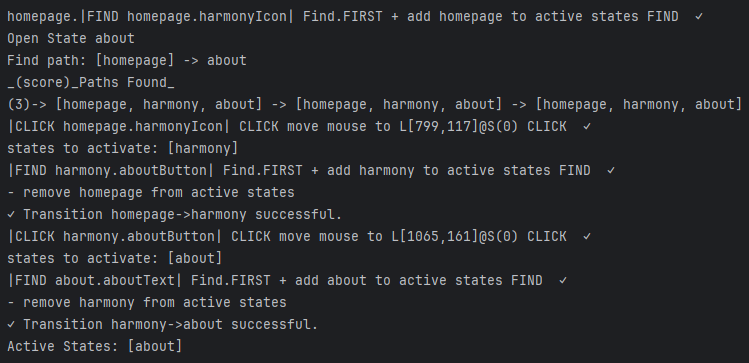

The final folder structure:

Below is a video of the live automation.

<ReactPlayer playing controls url='https://jspinak.github.io/brobot/img/mrdoob/mrdoob_live.mov' />

The console output during automation shows Brobot's state management and the actions performed:

