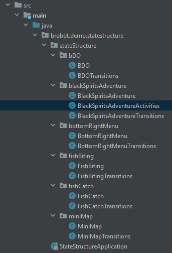

# Where do I go from here?

Now that you have a state structure, you can start writing the code for your automation program. 
How you do this is ultimately up to you, but I'll share here how I write my Brobot code.  

## Activities classes  

I usually create a class with the name _someClass_ + "Activities" for actions that happen within 
a specific class. We have a class called _BlackSpriritsAdventure_ inside the folder _blackSpiritsAdventure_. If I want
to click on the _Acquire_ button, I would first create a class called _BlackSpriritsAdventureActivities_
within the same folder.  

 This class would inject 3 dependencies in its constructor: _BlackSpriritsAdventure_,
_StateTransitionsManagement_, and _Action_. If you have correctly defined the transitions in each of your transitions classes, 
you can use the _StateTransitionsManagement_ class to open any state in your application. It doesn't matter 
where you are currently in the environment, as long as you have defined the transitions correctly, you can
open any state.  

The _BlackSpriritsAdventure_ dependency is necessary only to reference the objects in it (here, the 
_Acquire_ button). To open the state with the _StateTransitionsManagement_ dependency, you don't need to inject
the _BlackSpriritsAdventure_ state class. This is because the _StateTransitionsManagement_ class's _open_ method takes an _Enum_ object
as a parameter. The _Enum_ object is the name of the state you want to open (here, BLACKSPIRITSADVENTURE), 
and it is defined as a public variable. If we just wanted to open the _BlackSpriritsAdventure_ state, we wouldn't
need a _BlackSpriritsAdventureActivities_ class; we could open it with one line of code: 

    stateTransitionsManagement.openState(BLACKSPIRITSADVENTURE);

_Action_ is used to perform actions on the screen.

Our class _BlackSpriritsAdventureActivities_ would look like this:  

    @Component
    public class BlackSpriritsAdventureActivities {
    
        private BlackSpriritsAdventure blackSpriritsAdventure;
        private StateTransitionsManagement stateTransitionsManagement;
        private Action action;
    
        public BlackSpriritsAdventureActivities(BlackSpriritsAdventure blackSpriritsAdventure,
                                                StateTransitionsManagement stateTransitionsManagement,
                                                Action action) {
            this.blackSpriritsAdventure = blackSpriritsAdventure;
            this.stateTransitionsManagement = stateTransitionsManagement;
            this.action = action;
        }
    
        public boolean acquire() {
            if (!stateTransitionsManagement.openState(BLACKSPIRITSADVENTURE)) return false;
            return action.perform(CLICK, blackSpriritsAdventure.getAcquireButton());
        }
    }

## Action basics

The _Action_ class is used to perform actions on the screen. It has a method called _perform_ that takes
an _ActionOptions_ object and an _ObjectCollection_ object. The _ActionOptions_ object defines the action
to be performed, and the _ObjectCollection_ object defines the objects on the screen that the action will
be performed on. The _ActionOptions_ object has a builder that allows you to define the action to be performed.
The _ObjectCollection_ object has a builder that allows you to define the objects on the screen that the action
will be performed on. The _ObjectCollection_ object can be created with a single object, or with a list of objects.

## Action tips

When using a standard action; for example, a single left click without any modifiers, you can use the
following code to perform the action:  

    action.perform(CLICK, objectCollection);

If you wish to use a non-standard action, you will need to create an _ActionOptions_ variable and 
specific its parameters. Then you would pass it to the _perform_ method along with the _ObjectCollection_ object.  

    ActionOptions actionOptions = ActionOptions.builder()
            .actionType(CLICK)
            .clickType(RIGHT)
            .build();
    action.perform(actionOptions, objectCollection);

The same applies to the _ObjectCollection_ object. If you wish to use a single image, you can just pass the 
image to the _perform_ method as such:

    action.perform(actionOptions, image);

If you want the action to be performed on multiple objects, you can use the _ObjectCollection_ builder to
create a list of objects.  

    ObjectCollection objectCollection = ObjectCollection.builder()
            .withImages(image1, image2, image3)
            .withRegions(region1, region2, region3)
            .build();
    action.perform(actionOptions, objectCollection);

To perform a standard click on one image:  

    action.perform(CLICK, image);
