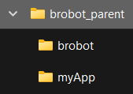
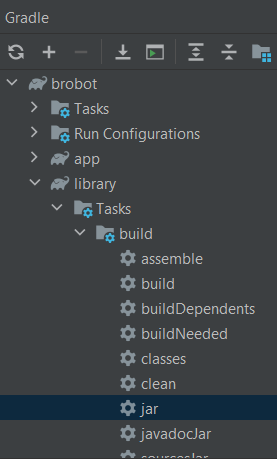
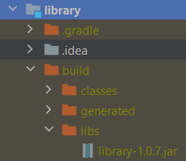

# Tutorial for Using the Latest Brobot Code in Github

This tutorial is for setting up a project to use the latest Brobot code in Github. The latest code has not 
been packaged and uploaded to Maven Central yet, but can still be used if you want the cutting edge features currently 
in development.

These are the steps we will follow in this tutorial:  

1. Create a folder for both your app and the Brobot library. Both repositories will live in this folder.
   
2. There is a demo app called myApp in the myBrobotApp repository. It can be found at
   https://github.com/jspinak/myBrobotApp. Fork the repository and then clone your forked 
   repository to your local machine. Put it in the folder you created. You can rename it if you like.
3. Clone the Brobot repository and place it in the folder you created, next to your app.
4. Create a JAR file of Brobot's library module. The following image shows how to do this in IntelliJ.
   To work with the latest code, you can update the Brobot repository and then recreate the JAR file.
   
5. Your app's build.gradle file should have this JAR file as a dependency. 
   If the relative filepath doesn't work, try the absolute filepath. You also may have to add the library manually:
   in IntelliJ, Project Structure -> Project Settings -> Libraries -> + -> find the location of the JAR file. It should
   be in the location in the image below. 
   
6. Make sure your IDE is configured correctly. Here are the settings I use in IntelliJ:  
   Settings  
   -> Gradle   
   ---> gradle-8.6  
   ---> build and run using gradle  
   ---> run tests using gradle  
   ---> Gradle JVM: Project SDK temurin-20 or equivalent  
   -> Compiler  
   ---> Java Compiler: project bytecode version 20  
   ---> Annotation Processors -> enable annotation processing should be checked  
   Project Structure  
   -> Project Settings  
   ---> Project: SDK = temurin-20 or equivalent  
   ---> Libraries: your app should have the Brobot JAR as a library. If not, you need to add it as shown above.  
   -> Platform Settings -> SDKs = temurin-20 or equivalent  
